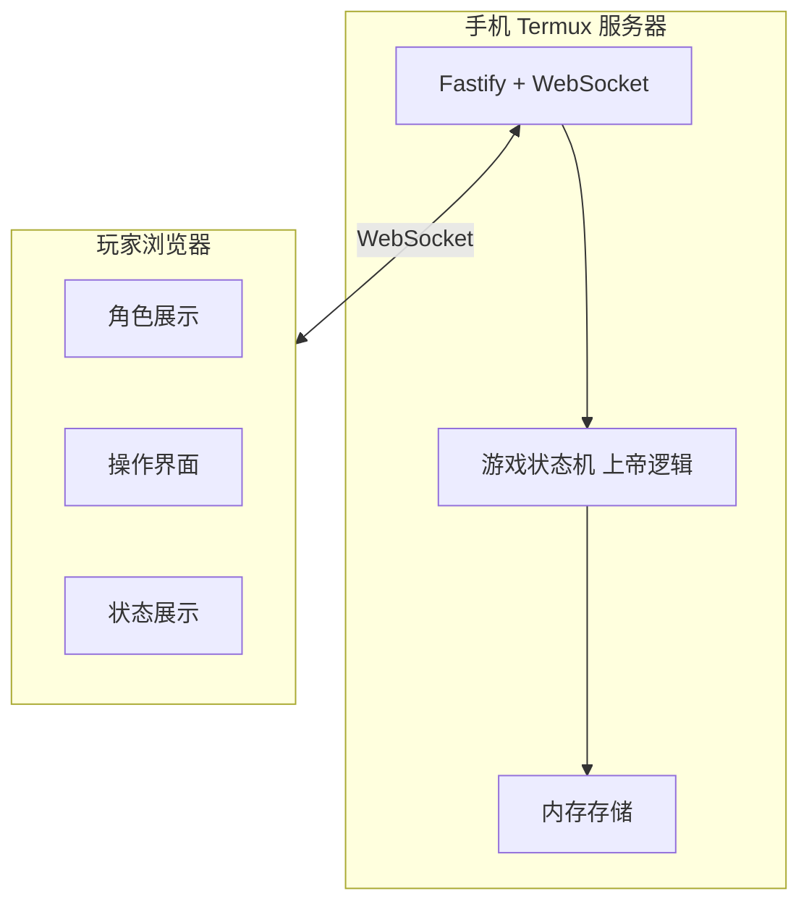
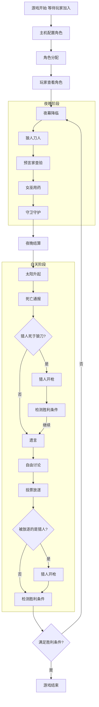
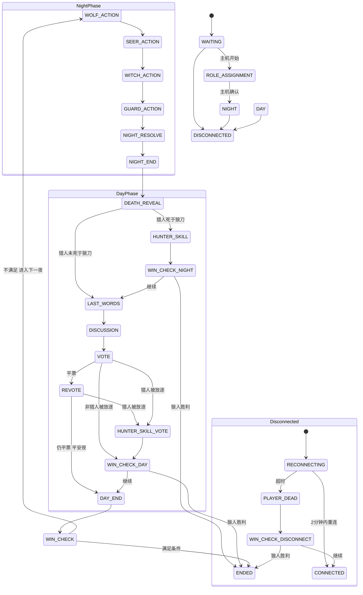
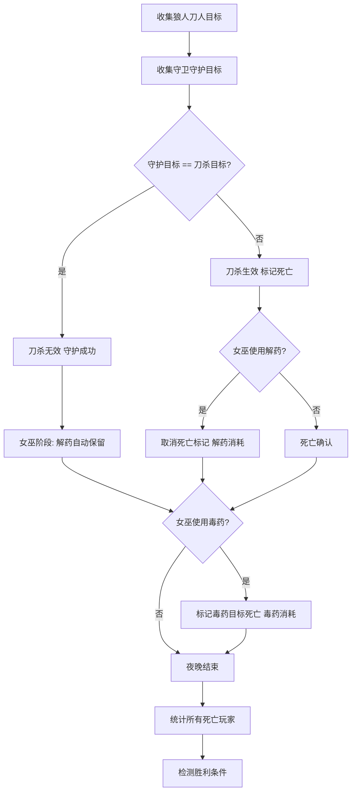
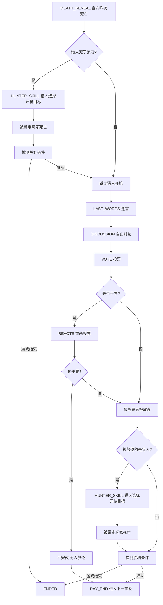
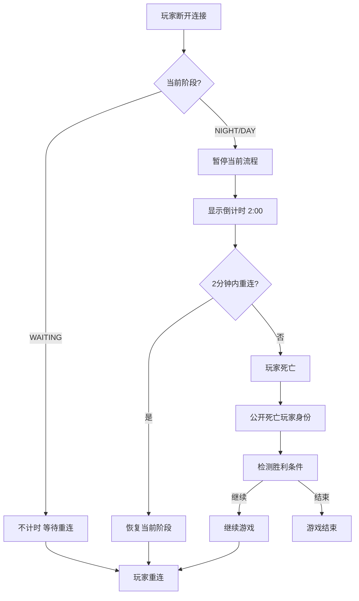

# 狼人杀 - 本地联机版 产品设计文档

## 1. 游戏概述

### 1.1 游戏定位
- **类型**: 本地局域网联机社交推理游戏
- **场景**: 线下聚会，大家围坐在一起
- **目标用户**: 5-12人线下群体
- **游戏时长**: 15-30分钟/局

### 1.2 核心特点
- **无上帝**: 服务器自动控制游戏流程
- **无计时**: 线下自由讨论
- **无房间**: 所有玩家直接加入同一个游戏
- **无密码**: 同一网络下直接加入

### 1.3 游戏平台
- **主机**: 手机 + Termux (运行服务器)
- **客户端**: 浏览器 (支持移动端和桌面端)
- **连接方式**: 同一局域网 (手机开 WiFi 热点)

---

## 2. 系统架构

### 2.1 架构图



### 2.2 连接流程

1. 手机开启 WiFi 热点
2. 手机运行服务器，记录显示 IP 地址（如 `192.168.43.1:3000`）
3. 其他玩家手机/电脑连接这个热点
4. 浏览器输入 `192.168.43.1:3000`
5. 输入昵称，加入游戏

### 2.3 数据存储策略
- **纯内存存储**: 游戏数据全部保存在内存中，不持久化
- **主机退出 = 游戏结束**: 主机意外退出时，所有玩家看到"服务器已断开"提示，需重新启动服务器
- **游戏结束后自动清空**: 每局结束后数据保留在内存中供查看，新游戏开始时覆盖

---

## 3. 游戏流程

### 3.1 整体流程图



### 3.2 阶段详细说明

#### 阶段一：等待加入
- 服务器运行后自动进入等待状态
- 玩家通过浏览器输入昵称加入
- 主机可以在手机上查看已加入玩家列表
- **主机设置角色配置**
- 主机点击"开始游戏"

#### 阶段二：角色分配
- 服务器随机洗牌分配角色
- 每个玩家在浏览器中查看自己的角色（仅自己可见）
- 主机在控制面板查看所有角色分配结果
- 主机点击"开始游戏"后进入夜晚（无需玩家确认，避免等待）

#### 阶段三：夜晚阶段
**所有人闭眼，服务器通过屏幕提示各玩家睁眼操作**

1. **狼人刀人**
   - 服务器提示"狼人请睁眼"
   - 狼人玩家在浏览器中选择今晚要杀的人
   - 狼人之间可以看到彼此身份
   - 狼人线下口头讨论，前端仅显示同伴是谁

2. **预言家查验**
   - 服务器提示"预言家请睁眼"
   - 预言家选择查验一名玩家
   - 服务器告知查验结果（好人/狼人）

3. **女巫用药**
   - 服务器提示"女巫请睁眼"
   - 显示昨夜狼刀目标
   - 女巫选择是否使用解药/毒药
   - 同一夜晚只能使用一种药

4. **守卫守护**
   - 服务器提示"守卫请睁眼"
   - 守卫选择守护一名玩家
   - 不能连续两晚守护同一人

#### 阶段四：白天阶段
1. **死亡通报** - 宣布昨夜死亡玩家及死因
2. **猎人开枪（狼刀触发）** - 若猎人死于狼刀，此时在浏览器中提示猎人选择开枪目标
3. **遗言** - 死亡玩家发表遗言
4. **自由发言** - 线下自由讨论（无计时）
5. **投票放逐** - 存活玩家在浏览器中投票
   - 若被放逐的是猎人，立即在浏览器中提示猎人选择开枪目标
   - 猎人开枪后，系统检测胜利条件

#### 阶段五：游戏结束
- 服务器检测胜利条件
- 宣布胜利阵营
- 显示各玩家真实身份

---

## 4. 阵营与角色

### 4.1 阵营划分

| 阵营 | 胜利条件 |
|------|---------|
| **好人阵营** | 消灭所有狼人 |
| **狼人阵营** | 狼人数量 >= 存活好人数量 |

### 4.2 角色列表

#### 神职角色（好人阵营）

| 角色 | 能力说明 |
|------|---------|
| **预言家** ⭐ | 每晚查验一人身份 |
| **女巫** ⭐ | 一瓶解药（救狼刀）+ 一瓶毒药 |
| **猎人** ⭐ | 死亡时可开枪带走一人 |
| **守卫** ⭐ | 每晚守护一人（不能连续守同一人） |
| **白痴** ⭐ | 被投票放逐可翻牌存活（失去投票权） |

> ⭐ 标记为神职角色

#### 普通角色（好人阵营）

| 角色 | 能力说明 |
|------|---------|
| **平民** | 无特殊能力，通过发言找出狼人 |

#### 狼人阵营

| 角色 | 能力说明 |
|------|---------|
| **普通狼人** | 夜间刀人 |

### 4.3 角色配置表

> 设计原则：
> - 狼人占比 20%-33%
> - 5-7人局精简神职，避免信息过载
> - 10人以上加入白痴，增加好人容错率
> - 守卫与白痴可同时存在（12人局），白痴防投票、守卫防狼刀
> - 5-9人局采用屠城规则（更简单平衡）
> - 10-12人局采用屠边规则（策略深度更高）

| 总人数 | 狼人 | 平民 | 预言家 | 女巫 | 猎人 | 守卫 | 白痴 | 狼人胜利规则 |
|-------|------|------|--------|------|------|------|------|------------|
| 5 | 1 | 2 | 1 | 1 | 0 | 0 | 0 | 屠城 |
| 6 | 2 | 2 | 1 | 1 | 0 | 0 | 0 | 屠城 |
| 7 | 2 | 3 | 1 | 1 | 0 | 0 | 0 | 屠城 |
| 8 | 2 | 3 | 1 | 1 | 1 | 0 | 0 | 屠城 |
| 9 | 3 | 3 | 1 | 1 | 1 | 0 | 0 | 屠城 |
| 10 | 3 | 3 | 1 | 1 | 1 | 0 | 1 | 屠边 |
| 11 | 3 | 4 | 1 | 1 | 1 | 0 | 1 | 屠边 |
| 12 | 4 | 3 | 1 | 1 | 1 | 1 | 1 | 屠边 |

> **胜利规则说明**：
> - **屠城规则**（5-9人局）：狼人数量 >= 存活好人数量时狼人获胜
>   - 规则简单，适合新手
> - **屠边规则**（10-12人局）：
>   - **屠神**：消灭所有神职角色（预言家、女巫、猎人、守卫、白痴）
>   - **屠民**：消灭所有平民
>   - 满足任一条件即胜利，策略深度更高

> **配置表说明**：
> - 神职角色（⭐）：预言家、女巫、猎人、守卫、白痴，共5种
> - 狼人占比 25%-33%

---

## 5. 角色详细规则

### 5.1 死亡规则

| 死亡方式 | 是否有遗言 | 猎人能否开枪 | 备注 |
|---------|----------|------------|------|
| 狼人刀杀 | 有 | 能 | 可被女巫救活 |
| 投票放逐 | 有 | 能 | - |
| 女巫毒杀 | 无 | 不能 | - |
| 猎人开枪带走 | 无 | 不能 | 不可触发自身技能 |

### 5.2 猎人规则
- 死于狼刀时，可以开枪带走一人
- 死于投票放逐时，可以开枪带走一人
- 死于女巫毒杀时，不能开枪
- 开枪时机分两种情况：
  - **狼刀死亡**：白天死亡通报后，遗言发表前，由系统在浏览器中提示猎人选择目标
  - **投票放逐**：投票结果公布后，立即在浏览器中提示猎人选择目标
- 被猎人带走的玩家立即死亡，不可触发自身技能，无遗言
- 猎人开枪后，系统需检测胜利条件（可能直接结束游戏）

### 5.3 守卫规则
- 每晚守护一名玩家（可以守护自己）
- 不能连续两晚守护同一人（包括自己）
- 与女巫解药冲突时，按以下顺序结算：
  1. 狼人刀人 → 确定刀杀目标
  2. 守卫守护 → 若守护目标与刀杀目标相同，则刀杀无效（守护成功）
  3. 女巫用药 → 若刀杀已被守护化解，女巫的解药自动保留（不消耗）
  4. 若守护失败（未守到刀杀目标），女巫可选择是否使用解药

### 5.4 女巫规则
- 拥有一瓶解药和一瓶毒药，每局游戏各只能用一次
- 解药只能救被狼人刀杀的玩家（不能救被毒杀/其他死亡的玩家）
- 首夜（第1个夜晚）被刀杀时，女巫可以自救；非首夜被刀杀时，女巫不能自救
- 同一夜晚不能同时使用解药和毒药
- 女巫用药后，系统需检测胜利条件（可能直接结束游戏）

### 5.5 白痴规则
- 被投票放逐时，翻牌证明身份后继续存活
- 存活但永久失去投票权（包括正常投票和平票重投）
- 夜晚死亡仍然死亡（被狼刀、女巫毒杀均正常死亡）
- 白痴翻牌后，狼人仍不知道其身份（仅好人知道）
- 白痴翻牌后仍计为存活（屠神规则下，狼人必须杀死白痴才算屠神成功）

### 5.6 投票规则
- 所有存活玩家必须投票（白痴除外）
- 弃票视为不计入任何人的票数（有效弃权）
- 票数最多者被放逐
- 平票处理：
  1. 若多人票数相同且均为最高票，则这些玩家进入"平票候选"
  2. 所有存活玩家对平票候选重新投票一轮
  3. 若第二轮仍平票，则平安夜（无人被放逐），直接进入下一夜晚

### 5.7 通用规则
- 狼人可以选择刀自己的同伴或自己（允许自刀）
- 同一夜晚女巫只能使用一种药（救或毒，不能同时）

---

## 6. 胜利条件

### 6.1 好人胜利
- 所有狼人出局

### 6.2 狼人胜利
狼人胜利条件由当前玩家人数决定：

**屠城规则**（5-9人局）：
- 存活狼人数量 >= 存活好人数量时狼人获胜
- 规则简单，适合新手局

**屠边规则**（10-12人局）：
- **屠神**：消灭所有神职角色（预言家、女巫、猎人、守卫、白痴）
- **屠民**：消灭所有平民
- 满足任一条件即胜利，策略深度更高

### 6.3 胜利条件检测时机
系统在以下节点自动检测胜利条件：
1. 夜晚结算完成后
2. 猎人开枪后
3. 女巫用药后（毒药生效）
4. 投票放逐后
5. 猎人被放逐开枪后

---

## 7. 断线重连机制

### 7.1 断线处理

| 场景 | 处理方式 |
|------|---------|
| 等待阶段断线 | 不计时，玩家随时可以重连回来 |
| 游戏进行中断线 | 暂停当前流程，显示"玩家XXX断线，等待重连..."，开始2分钟倒计时 |
| 2分钟内重连 | 恢复当前阶段，继续游戏 |
| 2分钟未重连 | 该玩家死亡，公开其身份，继续游戏 |

### 7.2 断线倒计时
- 倒计时期间，其他玩家可以看到倒计时提示
- 倒计时结束仍未重连，该玩家死亡，系统检测胜利条件
- 如果死亡的是狼人，狼人阵营少一票刀人；如果是神职，好人阵营失去信息源

### 7.3 游戏中途加入
- 游戏开始后，不允许新玩家加入
- 加入入口关闭，新访问者看到"游戏进行中，无法加入"提示

---

## 8. 主机异常处理

### 8.1 主机退出
- 主机（运行 Termux 的手机）意外退出服务器时，所有玩家 WebSocket 断开
- 所有玩家看到"服务器已断开，请让主机重新启动服务器"提示
- 不尝试数据恢复，主机重启后重新开始一局

### 8.2 数据存储
- 游戏数据全部保存在内存中，不持久化到磁盘
- 游戏结束后数据保留在内存中供查看结果
- 新游戏开始时覆盖旧数据

---

## 9. 玩家界面设计

### 9.1 加入页面
```
┌─────────────────────────────────┐
│                                 │
│       🐺 狼 人 杀 🐺           │
│                                 │
│  ┌───────────────────────────┐ │
│  │     输入你的昵称            │ │
│  └───────────────────────────┘ │
│                                 │
│  ┌───────────────────────────┐ │
│  │         加 入 游 戏        │ │
│  └───────────────────────────┘ │
│                                 │
│  服务器: 192.168.43.1:3000     │
│                                 │
└─────────────────────────────────┘
```

### 9.2 等待大厅页面
```
┌─────────────────────────────────┐
│  🐺 狼人杀            [❓帮助] │
│─────────────────────────────────│
│  当前玩家 (3)                   │
│  ┌─────────────────────────────┐│
│  │ 👤 张三  [主机]              ││
│  │ 👤 李四                      ││
│  │ 👤 王五                      ││
│  └─────────────────────────────┘│
│                                 │
│  角色配置: 7人局 ▼               │
│  ┌───────────────────────────┐ │
│  │ 狼人x2 平民x3 预言家x1      │ │
│  │ 女巫x1 猎人x1              │ │
│  └───────────────────────────┘ │
│                                 │
│  ┌───────────────────────────┐ │
│  │       开始游戏 (主机)       │ │
│  └───────────────────────────┘ │
└─────────────────────────────────┘

┌─────────────────────────────────┐
│        ❓ 游戏帮助               │
│─────────────────────────────────│
│  【角色说明】                    │
│  ━━━━━━━━━━━━━━━━━━━━━━━━━━━━━ │
│  🐺 狼人：夜间与同伴讨论后刀人    │
│  👤 平民：无特殊能力，靠发言找狼  │
│  👁️ 预言家：每晚查验一人身份      │
│  🧪 女巫：解药救人 + 毒药毒人     │
│  🔫 猎人：死亡可开枪带走一人      │
│  🛡️ 守卫：每晚守护一人            │
│  🤪 白痴：被投票可翻牌存活        │
│                                 │
│  【胜利条件】                    │
│  ━━━━━━━━━━━━━━━━━━━━━━━━━━━━━ │
│  好人胜利：所有狼人出局           │
│  狼人胜利：                     │
│  • 5-9人局(屠城)：狼人数量≥好人  │
│  • 10-12人局(屠边)：            │
│    屠神(杀光神职)或屠民(杀光平民)│
│                                 │
│  【游戏流程】                    │
│  ━━━━━━━━━━━━━━━━━━━━━━━━━━━━━ │
│  夜晚 → 狼人刀人 → 预言家查验 →  │
│  女巫用药 → 守卫守护             │
│  白天 → 死亡通报 → 遗言 →        │
│  自由讨论 → 投票放逐              │
│                                 │
│            [ 关 闭 ]            │
└─────────────────────────────────┘
```

### 9.3 角色查看页面
```
┌─────────────────────────────────┐
│        🎭 角 色 分 配            │
│                                 │
│   你的身份是：                    │
│                                 │
│  ┌───────────────────────────┐ │
│  │                           │ │
│  │        👁️ 预 言 家          │ │
│  │                           │ │
│  │  每晚可以查验一名玩家的      │ │
│  │  身份（好人或狼人）         │ │
│  │                           │ │
│  └───────────────────────────┘ │
│                                 │
│  请牢记你的身份，不要泄露         │
│                                 │
│        [ 我 已 知 道 ]          │
│                                 │
└─────────────────────────────────┘
```

### 9.4 夜晚操作页面（示例：预言家）
```
┌─────────────────────────────────┐
│        🌙 夜 晚 🌙              │
│                                 │
│   预言家，请选择要查验的玩家      │
│                                 │
│  ┌─────┐ ┌─────┐ ┌─────┐      │
│  │张三 │ │李四 │ │王五 │      │
│  │ 存活│ │ 存活│ │ 存活│      │
│  └─────┘ └─────┘ └─────┘      │
│  ┌─────┐ ┌─────┐              │
│  │赵六 │ │孙七 │              │
│  │ 存活│ │ 存活│              │
│  └─────┘ └─────┘              │
│                                 │
│        [ 确 定 查 验 ]          │
│                                 │
└─────────────────────────────────┘
```

### 9.5 夜晚等待页面（非当前行动玩家）
```
┌─────────────────────────────────┐
│        🌙 夜 晚 🌙              │
│                                 │
│                                 │
│      请耐心等待...              │
│                                 │
│      其他玩家正在行动中...        │
│                                 │
│                                 │
│   ┌─────────────────────────┐  │
│   │  你 的 角 色           │  │
│   │  ┌─────────────────┐  │  │
│   │  │                 │  │  │
│   │  │     平 民        │  │  │
│   │  │                 │  │  │
│   │  └─────────────────┘  │  │
│   └─────────────────────────┘  │
│                                 │
└─────────────────────────────────┘
```

### 9.6 狼人操作页面
```
┌─────────────────────────────────┐
│        🌙 夜 晚 🌙              │
│                                 │
│   狼人请睁眼                      │
│   你的狼人同伴：李四              │
│                                 │
│   请选择今晚要刀的人：            │
│                                 │
│  ┌─────┐ ┌─────┐ ┌─────┐      │
│  │张三 │ │王五 │ │赵六 │      │
│  │ 存活│ │ 存活│ │ 存活│      │
│  └─────┘ └─────┘ └─────┘      │
│  ┌─────┐ ┌─────┐              │
│  │孙七 │ │周八 │              │
│  │ 存活│ │ 存活│              │
│  └─────┘ └─────┘              │
│                                 │
│        [ 确 定 刀 人 ]          │
│                                 │
└─────────────────────────────────┘
```

### 9.7 女巫操作页面
```
┌─────────────────────────────────┐
│        🌙 夜 晚 🌙              │
│                                 │
│   女巫请睁眼                      │
│                                 │
│   昨夜死亡：李四（狼刀）          │
│                                 │
│   ┌───────────────────────────┐ │
│   │  剩余药水                  │ │
│   │  💊 解药: 可用             │ │
│   │  ☠️ 毒药: 可用             │ │
│   └───────────────────────────┘ │
│                                 │
│   请选择操作：                   │
│   ○ 使用解药救李四               │
│   ○ 使用毒药                     │
│     ┌─────┐ ┌─────┐            │
│     │张三 │ │王五 │            │
│     │ 存活│ │ 存活│            │
│     └─────┘ └─────┘            │
│   ○ 不使用药水                  │
│                                 │
│        [ 确 定 ]                │
│                                 │
└─────────────────────────────────┘
```

### 9.8 白天死亡通报页面
```
┌─────────────────────────────────┐
│        ☀️ 白 天 ☀️              │
│        第 2 天                   │
│                                 │
│─────────────────────────────────│
│  昨夜死亡：                      │
│                                 │
│  💀 李四（狼人刀杀）             │
│                                 │
│  （平安夜 / 多人死亡时列出）      │
│                                 │
│─────────────────────────────────│
│                                 │
│  请死亡玩家准备遗言               │
│                                 │
│        [ 我 知 道 了 ]          │
│                                 │
└─────────────────────────────────┘
```

### 9.9 白天投票页面
```
┌─────────────────────────────────┐
│        ☀️ 白 天 ☀️              │
│                                 │
│  请投票选出要放逐的玩家          │
│                                 │
│  ┌─────┐ ┌─────┐ ┌─────┐      │
│  │张三 │ │王五 │ │赵六 │      │
│  │ ○   │ │ ○   │ │ ○   │      │
│  └─────┘ └─────┘ └─────┘      │
│  ┌─────┐ ┌─────┐              │
│  │孙七 │ ○   │周八 │          │
│  │ 存活│       │ 存活│        │
│  └─────┘       └─────┘        │
│                                 │
│  ○ 弃票                         │
│                                 │
│        [ 投 票 ]                │
│                                 │
│  投票进度: 3/7                 │
└─────────────────────────────────┘
```

### 9.10 游戏结束页面
```
┌─────────────────────────────────┐
│        🎉 游 戏 结 束 🎉        │
│                                 │
│       好人阵营胜利！             │
│                                 │
│  ┌───────────────────────────┐ │
│  │  角色公布                  │ │
│  │  ─────────────────────── │ │
│  │  张三: 🐺 狼人             │ │
│  │  李四: 🐺 狼人             │ │
│  │  王五: 👁️ 预言家           │ │
│  │  赵六: 🧪 女巫             │ │
│  │  孙七: 🔫 猎人             │ │
│  │  周八: 🛡️ 守卫             │ │
│  │  吴九: 👤 平民             │ │
│  └───────────────────────────┘ │
│                                 │
│  ┌───────────────────────────┐ │
│  │       再 来 一 局          │ │
│  └───────────────────────────┘ │
└─────────────────────────────────┘
```

### 9.11 断线页面
```
┌─────────────────────────────────┐
│        ⚠️ 连 接 中 断            │
│                                 │
│                                 │
│      你已断开连接                 │
│                                 │
│      正在尝试重新连接...          │
│                                 │
│      倒计时: 01:45              │
│                                 │
│   如果倒计时结束仍未重连，        │
│   你将被判定为死亡               │
│                                 │
│        [ 立 即 重 连 ]          │
│                                 │
└─────────────────────────────────┘
```

### 9.12 游戏进行中无法加入页面
```
┌─────────────────────────────────┐
│                                 │
│       🐺 狼 人 杀 🐺           │
│                                 │
│                                 │
│      游戏进行中                  │
│                                 │
│      当前局已开始，              │
│      无法加入                    │
│                                 │
│      请等待本局结束后           │
│      或主机重新开始              │
│                                 │
│                                 │
└─────────────────────────────────┘
```

### 9.13 Modal 组件说明

游戏中使用 Modal（模态弹窗）来处理轻量级的交互提示，避免频繁跳转页面打断游戏节奏。

#### 9.13.1 遗言提示 Modal
```
┌─────────────────────────────────┐
│                                 │
│      ┌─────────────────────┐   │
│      │  🎤 遗 言            │   │
│      │                     │   │
│      │  请死亡玩家发表遗言   │   │
│      │                     │   │
│      │  李四、王五           │   │
│      │  （点击名字查看身份）  │   │
│      │                     │   │
│      │  ┌───────────────┐ │   │
│      │  │  遗 言 结 束   │ │   │
│      │  └───────────────┘ │   │
│      └─────────────────────┘   │
│                                 │
└─────────────────────────────────┘
```
- **触发时机**: 死亡通报后（猎人开枪后或无猎人开枪时）
- **显示内容**: 提示当前需要发表遗言的死亡玩家
- **操作**: 死亡玩家线下发言后，点击"遗言结束"继续流程
- **注意**: 遗言是线下社交环节，系统仅做提示，不记录内容

#### 9.13.2 白痴翻牌 Modal
```
┌─────────────────────────────────┐
│                                 │
│      ┌─────────────────────┐   │
│      │  🤪 白 痴 翻 牌      │   │
│      │                     │   │
│      │  ┌───────────────┐ │   │
│      │  │               │ │   │
│      │  │   🤪 白 痴     │ │   │
│      │  │               │ │   │
│      │  └───────────────┘ │   │
│      │                     │   │
│      │  张三已证明身份      │   │
│      │  继续存活但失去投票权 │   │
│      │                     │   │
│      │  ┌───────────────┐ │   │
│      │  │  我 知 道 了   │ │   │
│      │  └───────────────┘ │   │
│      └─────────────────────┘   │
│                                 │
└─────────────────────────────────┘
```
- **触发时机**: 投票结果公布后，若被放逐的玩家是白痴
- **显示内容**: 白痴身份牌 + 翻牌提示
- **操作**: 所有玩家点击"我知道了"后继续流程
- **后续**: 白痴继续存活，但永久失去投票权

#### 9.13.3 投票结果 Modal
```
┌─────────────────────────────────┐
│                                 │
│      ┌─────────────────────┐   │
│      │  📊 投 票 结 果      │   │
│      │                     │   │
│      │  张三: 3票           │   │
│      │  李四: 2票           │   │
│      │  王五: 1票           │   │
│      │  弃票: 1票           │   │
│      │                     │   │
│      │  ─────────────────  │   │
│      │  李四被放逐！        │   │
│      │                     │   │
│      │  ┌───────────────┐ │   │
│      │  │  我 知 道 了   │ │   │
│      │  └───────────────┘ │   │
│      └─────────────────────┘   │
│                                 │
└─────────────────────────────────┘
```
- **触发时机**: 所有玩家投票完成后
- **显示内容**: 各玩家得票数 + 被放逐的玩家
- **操作**: 所有玩家点击"我知道了"后继续流程
- **分支**:
  - 若被放逐的是猎人 → 触发猎人开枪
  - 若被放逐的是白痴 → 触发白痴翻牌
  - 否则 → 进入遗言阶段

#### 9.13.4 平票重投 Modal
```
┌─────────────────────────────────┐
│                                 │
│      ┌─────────────────────┐   │
│      │  ⚖️ 平 票 重 投      │   │
│      │                     │   │
│      │  张三: 3票           │   │
│      │  李四: 3票           │   │
│      │                     │   │
│      │  ─────────────────  │   │
│      │  平票！              │   │
│      │  请对以下玩家重投:    │   │
│      │  张三、李四           │   │
│      │                     │   │
│      │  ┌───────────────┐ │   │
│      │  │  开 始 重 投   │ │   │
│      │  └───────────────┘ │   │
│      └─────────────────────┘   │
│                                 │
└─────────────────────────────────┘
```
- **触发时机**: 投票出现多人最高票相同
- **显示内容**: 平票玩家列表
- **操作**: 点击"开始重投"进入重投投票界面
- **重投规则**:
  - 只对平票候选投票
  - 若重投仍平票 → 平安夜，无人被放逐

#### 9.13.5 夜晚结算过渡 Modal
```
┌─────────────────────────────────┐
│                                 │
│      ┌─────────────────────┐   │
│      │  🌙 夜 晚 结 算      │   │
│      │                     │   │
│      │      ⏳              │   │
│      │                     │   │
│      │  结算中...           │   │
│      │                     │   │
│      └─────────────────────┘   │
│                                 │
└─────────────────────────────────┘
```
- **触发时机**: 所有角色夜间操作完成后
- **显示内容**: 简短的结算动画/提示
- **持续时间**: 1-2秒
- **后续**: 自动进入白天死亡通报页面

---

## 10. 主机控制界面（手机端）

### 10.1 主机面板（等待阶段）
```
┌─────────────────────────────────┐
│  🐺 主机控制面板                 │
│─────────────────────────────────│
│  状态: 等待开始                  │
│  玩家数: 7                      │
│─────────────────────────────────│
│                                 │
│  角色配置                        │
│  ┌───────────────────────────┐ │
│  │ 预设: 7人局 ▼               │ │
│  │ 狼人: 2                     │ │
│  │ 平民: 3                    │ │
│  │ 预言家: 1                  │ │
│  │ 女巫: 1                    │ │
│  │ 猎人: 0 [+] [-]            │ │
│  │ 守卫: 0 [+] [-]            │ │
│  │ 白痴: 0 [+] [-]            │ │
│  └───────────────────────────┘ │
│                                 │
│  当前玩家:                       │
│  张三, 李四, 王五, 赵六,         │
│  孙七, 周八, 吴九                │
│                                 │
│  ┌───────────────────────────┐ │
│  │       开 始 游 戏          │ │
│  └───────────────────────────┘ │
│                                 │
└─────────────────────────────────┘
```

**功能说明**:
- **预设选择**: 根据当前人数自动推荐配置，主机可手动调整
- **角色数量调整**: 通过 [+]/[-] 按钮增减各角色数量
- **实时校验**: 角色总数必须等于当前玩家数，否则"开始游戏"按钮禁用
- **玩家列表**: 显示已加入的玩家昵称

### 10.2 主机面板（游戏进行中）
```
┌─────────────────────────────────┐
│  🐺 主机控制面板                 │
│─────────────────────────────────│
│  状态: 🌙 夜晚 - 狼人刀人        │
│  第 2 天                        │
│─────────────────────────────────│
│                                 │
│  存活玩家: 6                     │
│  死亡玩家: 1                     │
│  ────────────────────────────  │
│  💀 李四（狼人刀杀）             │
│                                 │
│  ┌───────────────────────────┐ │
│  │       重新开始              │ │
│  └───────────────────────────┘ │
│                                 │
└─────────────────────────────────┘
```

**功能说明**:
- **状态显示**: 当前游戏阶段（夜晚/白天）+ 子阶段（狼人刀人/预言家查验等）
- **天数显示**: 当前第几天
- **存活/死亡统计**: 实时显示存活和死亡玩家数量
- **死亡记录**: 显示已死亡玩家及死因
- **重新开始**: 主机可随时点击重新开始，结束当前局并重新开始

### 10.3 主机面板（角色分配后）
```
┌─────────────────────────────────┐
│  🐺 主机控制面板                 │
│─────────────────────────────────│
│  状态: 🎭 角色已分配             │
│  等待玩家查看角色...             │
│─────────────────────────────────│
│                                 │
│  角色分配结果（仅主机可见）:       │
│  🐺 张三: 狼人                   │
│  🐺 李四: 狼人                   │
│  👁️ 王五: 预言家                 │
│  🧪 赵六: 女巫                   │
│  🔫 孙七: 猎人                   │
│  👤 周八: 平民                   │
│  👤 吴九: 平民                   │
│                                 │
│  ┌───────────────────────────┐ │
│  │  进 入 夜 晚 (开始游戏)     │ │
│  └───────────────────────────┘ │
│                                 │
└─────────────────────────────────┘
```

**功能说明**:
- **角色总览**: 主机可以看到所有玩家的角色分配（上帝视角）
- **进入夜晚**: 主机确认后，无需等待所有玩家查看角色，直接进入夜晚阶段

---

## 11. 游戏状态流转

### 11.1 状态定义

```
GamePhase:
  - WAITING          // 等待玩家加入
  - ROLE_ASSIGNMENT  // 角色分配
  - NIGHT            // 夜晚
  - DAY              // 白天
  - ENDED            // 游戏结束

NightPhase:
  - NONE             // 无
  - WOLF_ACTION      // 狼人刀人
  - SEER_ACTION      // 预言家查验
  - WITCH_ACTION     // 女巫用药
  - GUARD_ACTION     // 守卫守护
  - NIGHT_RESOLVE    // 夜晚结算
  - NIGHT_END        // 夜晚结束

DayPhase:
  - NONE             // 无
  - DEATH_REVEAL     // 死亡通报
  - HUNTER_SKILL     // 猎人开枪（若触发）
  - LAST_WORDS       // 遗言
  - DISCUSSION       // 自由讨论
  - VOTE             // 投票
  - REVOTE           // 平票重投
  - DAY_END          // 白天结束

ConnectionState:
  - CONNECTED        // 已连接
  - DISCONNECTED     // 已断开
  - RECONNECTING     // 重连中
```

### 11.2 状态转换图



### 11.3 夜晚结算逻辑



### 11.4 白天结算逻辑



### 11.5 断线重连逻辑


