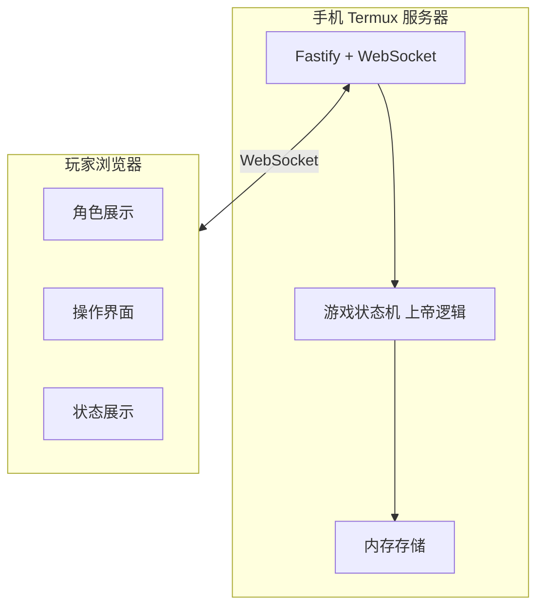

# 狼人杀 - 本地联机版 系统架构

## 1. 架构图



## 2. 技术栈

- **服务器**: Fastify + WebSocket (Node.js)
- **客户端**: React + TypeScript
- **通信**: WebSocket (实时) + HTTP (初始加入)
- **存储**: 纯内存 (不持久化)

## 3. 客户端结构

```
client/
├── src/
│   ├── pages/              # 页面组件 (每个页面对应一个游戏阶段)
│   │   ├── join-page.tsx
│   │   ├── lobby-page.tsx
│   │   ├── role-page.tsx
│   │   ├── night/          # 夜晚阶段页面
│   │   │   ├── night-wait-page.tsx
│   │   │   ├── wolf-action-page.tsx
│   │   │   ├── seer-action-page.tsx
│   │   │   ├── witch-action-page.tsx
│   │   │   └── guard-action-page.tsx
│   │   ├── day/            # 白天阶段页面
│   │   │   ├── day-reveal-page.tsx
│   │   │   ├── hunter-skill-page.tsx
│   │   │   └── vote-page.tsx
│   │   ├── end-page.tsx
│   │   ├── disconnect-page.tsx
│   │   ├── no-join-page.tsx
│   │   └── timeout-page.tsx
│   ├── components/         # 可复用组件
│   │   ├── player-list.tsx
│   │   ├── player-grid.tsx
│   │   ├── role-display.tsx
│   │   ├── help-overlay.tsx
│   │   └── ...
│   ├── hooks/              # 自定义 Hooks
│   │   ├── useWebSocket.ts
│   │   └── useGameState.ts
│   ├── types/              # TypeScript 类型定义
│   │   └── index.ts
│   └── utils/              # 工具函数
│       └── ...
└── ...
```

## 4. 通信方式

- **HTTP**: 用于初始加入游戏（`POST /api/join`，返回 `playerId` 与会话凭证）
- **WebSocket**: 用于游戏过程中的实时通信（连接建立后仅处理游戏事件，不再重复加入）

## 5. 设计模式

- **状态机驱动**: 游戏状态由服务器控制，客户端根据状态渲染对应页面
- **组件化**: 每个页面对应一个 React 组件，可复用组件提取为独立组件
- **事件驱动**: WebSocket 事件触发状态更新和页面跳转
- **配置中心化**: 服务器根据人数自动套用标准平衡预设（6-12人），客户端仅只读展示

---

> **相关文档**:
> - [游戏介绍](./01-game-overview.md)
> - [状态机与事件](./06-state-machine-events.md)
