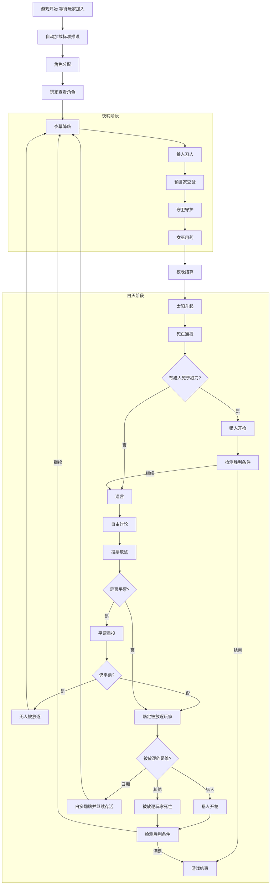
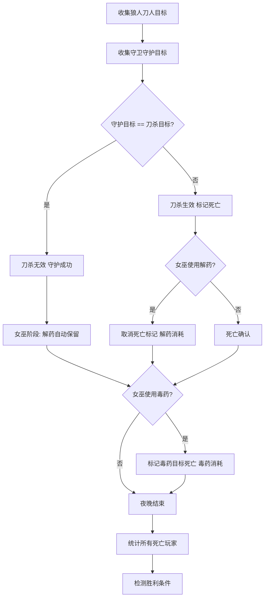
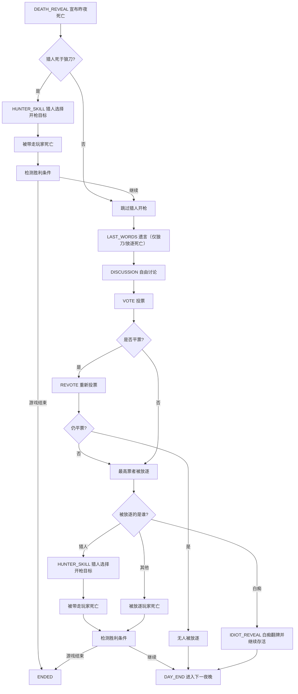

# 狼人杀 - 本地联机版 游戏流程

## 1. 整体流程图

## 2. 阶段详细说明

### 2.1 阶段一：等待加入
- 服务器运行后自动进入等待状态
- 玩家通过浏览器输入昵称加入（主机也是普通玩家，需要输入昵称加入）
- 主机可以在手机上查看已加入玩家列表
- **服务器按当前人数自动加载标准平衡预设（6-12人）**
- **标准模式下角色配置不可手动调整**
- 玩家人数少于6或多于12时，"开始游戏"按钮禁用
- 主机点击"开始游戏"

### 2.2 阶段二：角色分配
- 服务器根据当前人数匹配标准预设后，随机洗牌分配角色
- 每个玩家在浏览器中查看自己的角色（仅自己可见，主机也不例外）
- 角色分配完成后自动进入夜晚阶段（无需主机确认，避免等待）

### 2.3 阶段三：夜晚阶段
**所有人闭眼，服务器通过屏幕提示各玩家睁眼操作**

1. **狼人刀人**
   - 服务器提示"狼人请睁眼"
   - 狼人玩家在浏览器中选择今晚要杀的人
   - 狼人之间可以看到彼此身份
   - 狼人线下口头讨论，前端仅显示同伴是谁

2. **预言家查验**
   - 服务器提示"预言家请睁眼"
   - 预言家选择查验一名玩家
   - 服务器告知查验结果（好人/狼人）

3. **守卫守护**
   - 服务器提示"守卫请睁眼"
   - 守卫选择守护一名玩家
   - 不能连续两晚守护同一人

4. **女巫用药**
   - 服务器提示"女巫请睁眼"
   - 显示昨夜狼刀目标（若已被守卫守护，则显示"刀杀已被守护化解"）
   - 女巫选择是否使用解药/毒药
   - 同一夜晚只能使用一种药
   - 若刀杀已被守护化解，女巫的解药自动保留（不消耗）

### 2.4 阶段四：白天阶段
1. **死亡通报** - 宣布昨夜所有死亡玩家及死因（按死亡顺序）
2. **猎人开枪（狼刀触发）** - 若猎人死于狼刀，此时在浏览器中提示猎人选择开枪目标
   - 猎人开枪后，系统立即检测胜利条件
3. **遗言** - 仅狼刀死亡/投票放逐死亡玩家发表遗言（按死亡顺序；女巫毒杀、被猎人带走玩家无遗言）
4. **自由发言** - 线下自由讨论（无计时）
5. **投票放逐** - 存活玩家在浏览器中投票
   - 若平票，触发一次平票重投；若第二轮仍平票，则无人被放逐，直接进入下一夜晚
   - 若被放逐的是白痴，触发白痴翻牌，白痴继续存活但失去投票权，直接进入下一夜晚
   - 若被放逐的是猎人，立即在浏览器中提示猎人选择开枪目标
   - 猎人开枪后，系统检测胜利条件
6. **帮助查看（全局能力）** - 游戏进行中任意页面可点击右上角 `❓帮助`
   - 弹出规则摘要与职业说明（简版）
   - 关闭后回到原页面，不改变当前流程与状态

### 2.5 阶段五：游戏结束
- 服务器检测胜利条件
- 宣布胜利阵营
- 显示各玩家真实身份

## 3. 夜晚结算逻辑

## 4. 白天结算逻辑

---

> **相关文档**:
> - [游戏介绍](./01-game-overview.md)
> - [角色设计](./04-role-design.md)
> - [胜利条件](./05-victory-conditions.md)
