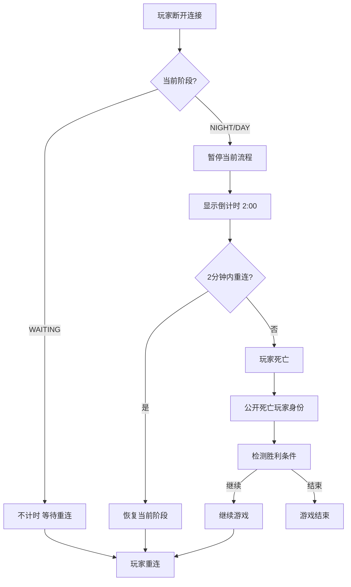

# 狼人杀 - 本地联机版 断线与异常处理

## 1. 断线重连机制

### 1.1 断线处理

| 场景 | 处理方式 |
|------|---------|
| 等待阶段断线 | 不计时，玩家随时可以重连回来 |
| 游戏进行中断线 | 暂停当前流程，显示"玩家XXX断线，等待重连..."，开始2分钟倒计时 |
| 2分钟内重连 | 恢复当前阶段，继续游戏 |
| 2分钟未重连 | 该玩家死亡，公开其身份，继续游戏 |

### 1.2 断线倒计时
- 倒计时期间，其他玩家可以看到倒计时提示
- 倒计时结束仍未重连，该玩家死亡，系统检测胜利条件
- 如果死亡的是狼人，狼人阵营少一票刀人；如果是神职，好人阵营失去信息源

### 1.3 断线重连逻辑

### 1.4 游戏中途加入
- 游戏开始后，不允许新玩家加入
- 加入入口关闭，新访问者看到"游戏进行中，无法加入"提示

## 2. 主机异常处理

### 2.1 主机退出
- 主机（运行 Termux 的手机）意外退出服务器时，所有玩家 WebSocket 断开
- 所有玩家看到"服务器已断开，请让主机重新启动服务器"提示
- 不尝试数据恢复，主机重启后重新开始一局

### 2.2 数据存储
- 游戏数据全部保存在内存中，不持久化到磁盘
- 游戏结束后数据保留在内存中供查看结果
- 新游戏开始时覆盖旧数据

---

> **相关文档**:
> - [系统架构](./02-system-architecture.md)
> - [状态机与事件](./06-state-machine-events.md)
